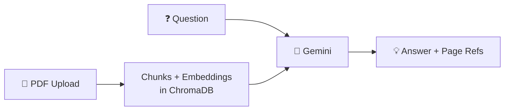

# 📄 Personal PDF Q&A — A Beginner-Friendly RAG App

A tiny, single-file Streamlit app that lets you upload a PDF and ask
questions about it. Answers come back grounded in the document, with
citations to the exact page(s) the answer was drawn from. Built end-to-end
with **Google Gemini** for generation, **sentence-transformers** for
embeddings (running locally — no API quota burned on indexing), and
**ChromaDB** as an in-memory vector store.

The whole app is ~300 lines in one file (`app.py`) on purpose: every line
has a comment explaining the *why*, and key design decisions are tagged
with `# INTERVIEW NOTE:` so you can grep for talking points before an
interview. Read top to bottom and you have a working mental model of how
modern RAG pipelines are built.

## Architecture



1. **PDF → chunks + embeddings → ChromaDB** happens once when you upload.
2. **Question → ChromaDB → top chunks → Gemini → answer** happens on every question.

## Setup (GitHub Codespaces)

**1. Get a free Gemini API key**
Visit <https://aistudio.google.com/app/apikey> and create one. Free tier is
~15 requests/minute, plenty for testing.

**2. Add it as a Codespaces secret**
On GitHub: your profile → **Settings** → **Codespaces** → **New secret**
- Name: `GOOGLE_API_KEY`
- Value: (paste your key)
- Repository access: select this repo

Then rebuild the codespace (Command Palette → "Codespaces: Rebuild Container")
so the secret becomes visible as an env var.

**3. Install dependencies and run**
```bash
pip install -r requirements.txt
streamlit run app.py
```

Codespaces will pop up an "Open in Browser" toast for port 8501. Click it.

> 💡 Running locally instead? Copy `.env.example` to `.env`, paste your key,
> then run the same two commands.

## Get a sample PDF to test with

The "Attention Is All You Need" paper (the original Transformer paper, 15 pages):

```bash
curl -L -o test.pdf https://arxiv.org/pdf/1706.03762
```

It's content-rich, famous, and a perfect demo PDF for an AI/ML interview.

## How RAG works in this project

Imagine you're a librarian helping someone find an answer in a 50-page
book. You wouldn't read the whole book to them — you'd find the 2–3
paragraphs that contain the answer and read those.

**That's RAG.** It has three steps:

1. **Indexing** (done once when you upload the PDF) — Break the PDF
   into small text snippets ("chunks"), then convert each chunk into
   a list of 384 numbers ("embedding") that represents its meaning.
   Chunks with similar meaning get similar number-lists. Store all of
   them in a small database (ChromaDB).

2. **Retrieval** (on every question) — Convert the user's question
   into the same kind of number-list using the same model. Then ask
   the database: "Which 4 chunks have number-lists most similar to
   this one?" Those are the most likely places the answer lives.

3. **Generation** (on every question) — Paste those 4 retrieved chunks
   into a prompt for Gemini, and instruct it to answer using **only**
   those chunks. Gemini becomes a "reading comprehension engine" over
   the relevant pages, not a know-it-all guessing from training data.

**Why is this better than just sending the whole PDF to Gemini?**
- *Cheaper:* You only send the relevant chunks, not the whole document.
- *More accurate:* Gemini focuses on the right parts instead of skimming.
- *Scalable:* Same approach works for a 1-page PDF or a 1,000-page library.
- *Trustworthy:* Because the answer is generated from specific chunks
  with known page numbers, you can show the user *where* the answer
  came from — which this app does in the "📍 Sources" caption.

## Try it out — sample questions for the Attention paper

Once you have `test.pdf` uploaded, try these in order:

1. **"What is the main topic of this paper?"**
   *Tests basic retrieval — should mention the Transformer architecture.*

2. **"What is multi-head attention?"**
   *Tests concept-level retrieval — should find the relevant subsection.*

3. **"What datasets were used in the experiments and what were the results?"**
   *Tests multi-fact retrieval — should mention WMT 2014 En-De / En-Fr and BLEU scores.*

4. **"How does the Transformer compare to RNN-based models in training time?"**
   *Tests comparison reasoning — needs chunks discussing both architectures.*

5. **"Who is the lead author and what's their email address?"**
   *Tests citation-style retrieval — should pull from page 1's author block.*

A great bonus question: **"What is the recipe for chocolate cake?"** — the
correct answer is *"I cannot find this information in the document."*
That answer proves the grounding instruction in the prompt is working.
